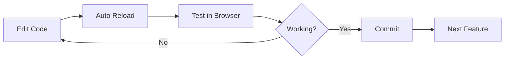

# ⚡ QUICK START

Panduan singkat untuk mulai develop setelah setup.

## 🚀 Start Developing (3 Commands)

```bash
# 1. Install dependencies (first time only)
pnpm install

# 2. Generate Prisma Client
pnpm db:generate

# 3. Start development servers
pnpm dev
```

✅ Frontend: http://localhost:3000  
✅ Backend: http://localhost:3001/graphql

---

## 📁 Project Structure - Quick Reference

```
apps/
  frontend/src/
    app/              # Next.js pages (App Router)
    components/       # React components
    lib/              # Utilities, hooks
  
  backend/src/
    auth/             # Authentication module
    users/            # User management
    content/          # Lessons, assignments
    prisma/           # Prisma service

packages/
  database/prisma/
    schema.prisma     # Database schema
  types/
    index.ts          # Shared types
```

---

## 🛠️ Daily Workflow

### 1. Start Working
```bash
pnpm dev
```

### 2. Database Changes
```bash
# Edit schema.prisma
pnpm db:push           # Push changes
pnpm db:generate       # Regenerate client
```

### 3. Check Database
```bash
pnpm db:studio         # Visual database browser
```

### 4. Run Specific App
```bash
pnpm --filter @lms/frontend dev
pnpm --filter @lms/backend dev
```

---

## 📝 Day 2 Checklist

### Morning:
- [ ] Setup Supabase Auth integration
- [ ] Create auth service (backend)
- [ ] Implement login API

### Afternoon:
- [ ] Create login form (frontend)
- [ ] Implement protected routes
- [ ] Test authentication flow

### Evening:
- [ ] Teacher create student flow
- [ ] Role switching UI
- [ ] Profile management

---

## 🔧 Common Tasks

### Add New Database Table
1. Edit `packages/database/prisma/schema.prisma`
2. Run `pnpm db:push`
3. Run `pnpm db:generate`

### Create New Frontend Page
1. Create file in `apps/frontend/src/app/page-name/page.tsx`
2. Auto-routed!

### Create New Backend Module
```bash
cd apps/backend
npx nest g module module-name
npx nest g service module-name
npx nest g resolver module-name
```

### Add New Type
1. Edit `packages/types/index.ts`
2. Auto-available in both frontend & backend

---

## 🐛 Quick Troubleshooting

**"Cannot find module '@lms/database'"**
```bash
pnpm db:generate
```

**"Port already in use"**
```bash
# Windows PowerShell
Get-Process -Id (Get-NetTCPConnection -LocalPort 3000).OwningProcess | Stop-Process
```

**"Database out of sync"**
```bash
pnpm db:push
```

**Start fresh**
```bash
pnpm clean
pnpm install
pnpm db:generate
```

---

## 📚 Key Files to Know

| File | Purpose |
|------|---------|
| `.env` | Environment variables (secrets) |
| `schema.prisma` | Database schema |
| `turbo.json` | Monorepo build config |
| `apps/frontend/src/app/layout.tsx` | Root layout |
| `apps/backend/src/app.module.ts` | Backend root module |

---

## 🎯 Development Flow



---

## 💡 Pro Tips

1. **Always run `pnpm dev` from root** (runs all apps)
2. **Use Prisma Studio** to inspect data visually
3. **Check GraphQL Playground** for backend API testing
4. **Hot reload works** - just save and see changes
5. **Read error messages carefully** - they're usually clear

---

## 📞 Need Help?

1. Check `SETUP.md` for detailed setup
2. Check `DAY1_SUMMARY.md` for what was built
3. Check `README.md` for project overview

---

**Ready to code! 🚀**
